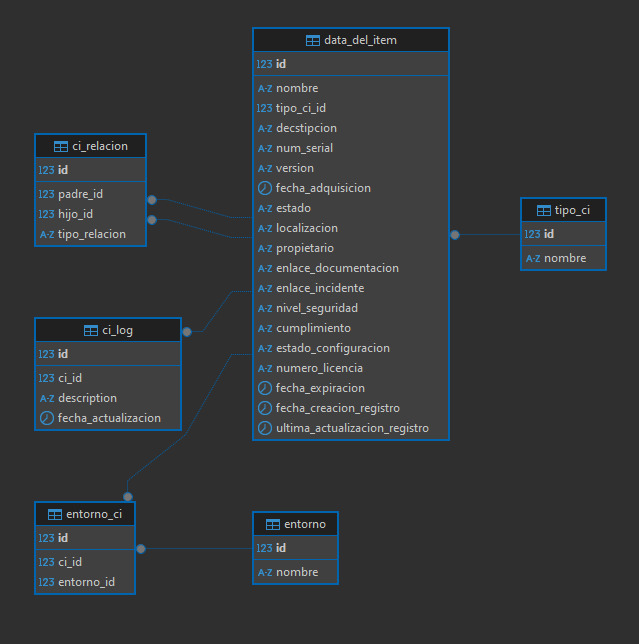

# Documentación de la Tarea
## Tecnologías utilizadas

- **FastAPI**: Framework para construir la API.
- **SQLAlchemy**: ORM para gestionar la base de datos.
- **PostgreSQL**: Sistema de gestión de bases de datos relacional.
- **Docker & Docker Compose**: Para contenerizar la base de datos.
- **Uvicorn**: Servidor ASGI para correr la aplicación de FastAPI.

---

## Estructura del proyecto
- **main.py**: Archivo principal que contiene las rutas y configuración de FastAPI.
- **crud.py**: Las funciones para acceder y modificar la base de datos usando SQLAlchemy.
- **schemas.py**: Definición de los modelos para validación de datos.
- **database.py**: Configuración de la conexión a la base de datos.
- **Dockerfile**: Configura la imagen Docker para la base de datos.
- **docker-compose.yml**: Orquestador para levantar el contenedor de PostgreSQL.
---

## Configuración de la base de datos
### Modelo ER

## Explicación de configuración
La base de datos PostgreSQL se ejecuta dentro de un contenedor Docker y se configura mediante las siguientes variables de entorno:

- `POSTGRES_USER`
- `POSTGRES_PASSWORD`
- `POSTGRES_DB`

El contenedor expone el puerto `5432` y se mapea al mismo puerto en el host para permitir la conexión local.

Además en esta el archivo `init.sql` que contiene la estructura de la DB y un par de valores de prueba para probar la API.

---

## Inicialización de la db
Con el entorno virtual de la DB de docker configurada es necesario levantar el contenedor, los siguiente comandos son los recomendados:
### Levantar el proyecto en segundo plano y hacer el build.
- `docker compose up -d --build`

### Eliminar los contenedores y volumenes
- `docker compose down -v --rmi all`

## Inicialización de la aplicacion
### Creación de entorno virtual e instalación de requerimientos
El primer paso es ir al directorio de la aplicación y correr lo siguiente:
- `python -m venv venv`
- `venv\Scripts\activate`
- `pip install -r requirements.txt`

Luego se ejecuta la api:
- `uvicorn main:app --reload`

Y se puede usar swagger para probar la API:
- `http://localhost:8000/docs`
